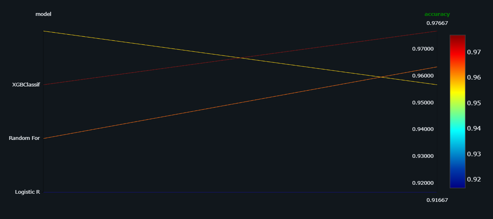
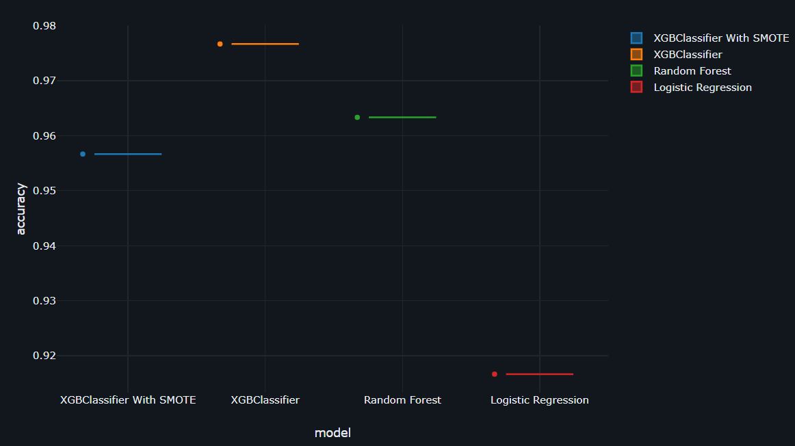
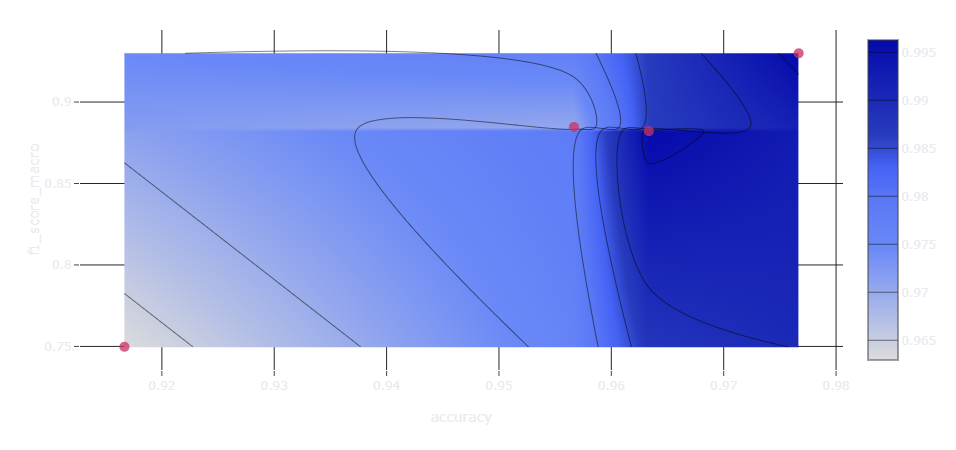

# 🚀 MLflow Binary Classification Project

## 📌 Overview

This project demonstrates an end-to-end Machine Learning workflow for Binary Classification with experiment tracking using MLflow.

The objective is to compare multiple machine learning algorithms, evaluate their performance, and identify the best model based on classification metrics.

The project includes:

- Data Preprocessing
- Handling Imbalanced Data using SMOTE
- Training Multiple Classification Models
- Model Performance Evaluation
- MLflow Experiment Tracking
- Visualization of Model Comparison
- Best Model Selection

---

## 🎯 Project Objectives

- Build and evaluate multiple classification models.
- Compare model performance using Accuracy and F1-Score.
- Handle class imbalance using SMOTE.
- Track experiments and metrics with MLflow.
- Visualize model performance for better interpretation.

---

## 🛠️ Technologies Used

| Technology | Purpose |
|------------|----------|
| Python | Programming Language |
| Pandas | Data Processing |
| NumPy | Numerical Computation |
| Scikit-Learn | Machine Learning |
| XGBoost | Gradient Boosting Model |
| Imbalanced-Learn | SMOTE Resampling |
| MLflow | Experiment Tracking |
| Matplotlib | Data Visualization |
| Seaborn | Statistical Visualization |

---

## 📂 Project Structure

```text
mlflow-binary-classification/
│
├── 2nd_mlflow_binaryclassification.ipynb
├── README.md
├── requirements.txt
│
└── images/
    ├── parallel_coordinates_plot.png
    ├── model_comparison.png
    ├── contour_plot.png

```

---

## 🔄 Workflow

### 1. Data Preprocessing

- Load Dataset
- Handle Missing Values
- Feature Engineering
- Train-Test Split

### 2. Data Balancing

The dataset imbalance is handled using:

```python
SMOTE()
```

Benefits:

- Balances minority classes
- Reduces prediction bias
- Improves model robustness

---

### 3. Models Trained

| Model |
|---------|
| Logistic Regression |
| Random Forest |
| XGBClassifier |
| XGBClassifier with SMOTE |

---

### 4. Experiment Tracking

MLflow is used to:

- Log Parameters
- Log Metrics
- Track Experiments
- Compare Runs
- Store Artifacts
- Identify Best Models

---

## 📊 Model Performance

| Rank | Model | Accuracy |
|------|---------|---------|
| 🥇 1 | XGBClassifier | 97.67% |
| 🥈 2 | Random Forest | 96.35% |
| 🥉 3 | XGBClassifier With SMOTE | 95.66% |
| 4 | Logistic Regression | 91.67% |

### 🏆 Best Performing Model

**XGBClassifier** achieved the highest accuracy of **97.67%** and delivered the best overall classification performance.

---

# 📷 Results & Visualizations

## 1️⃣ Parallel Coordinates Plot

This visualization compares model performance across different classification algorithms.



---

## 2️⃣ Box Plot

Visualize the distribution of numerical data.



---

## 3️⃣ Accuracy vs F1-Score Contour Analysis

Contour visualization showing the relationship between Accuracy and F1-Score.



---

## 📈 Key Insights

- XGBClassifier achieved the highest accuracy.
- Random Forest delivered strong performance with minimal performance difference.
- SMOTE improved class balance while maintaining high accuracy.
- Logistic Regression served as a baseline model but performed lower than ensemble methods.
- Ensemble learning methods significantly outperformed traditional linear models.

---


## ▶️ Running the Project

### Start MLflow UI

```bash
mlflow ui
```

Open:

```text
http://127.0.0.1:5000
```

### Run Jupyter Notebook

```bash
jupyter notebook
```

Open:

```text
2nd_mlflow_binaryclassification.ipynb
```

---


## 🌟 Features

✅ Binary Classification

✅ MLflow Experiment Tracking

✅ Model Comparison

✅ SMOTE Data Balancing

✅ Performance Visualization

✅ Reproducible Machine Learning Workflow

✅ XGBoost Optimization

---


## 👨‍💻 Author

### Manas Ranjan Meher

GitHub:
https://github.com/manasranjanmeher99

LinkedIn:
https://www.linkedin.com/in/manas-ranjan-meher-606181280/

---

⭐ If you found this project useful, consider giving it a star on GitHub.
