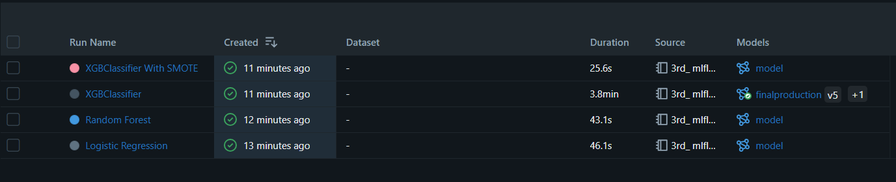
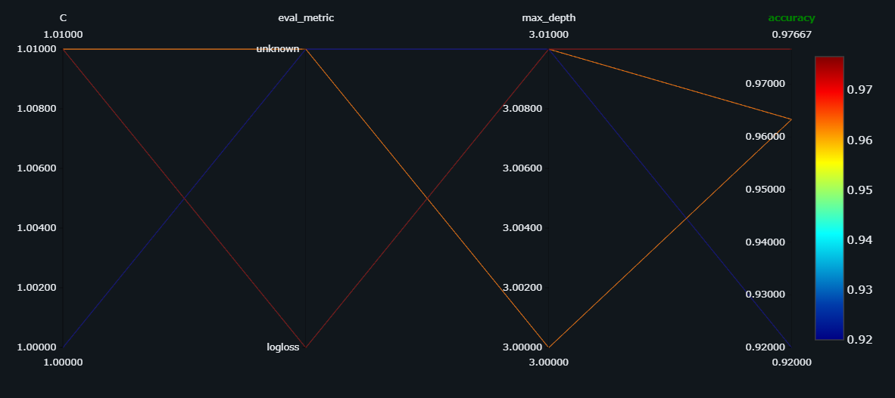
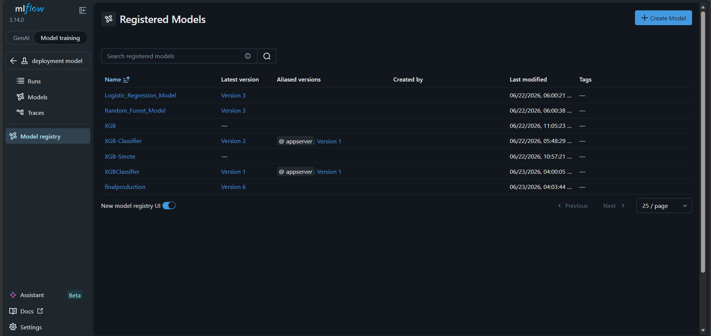
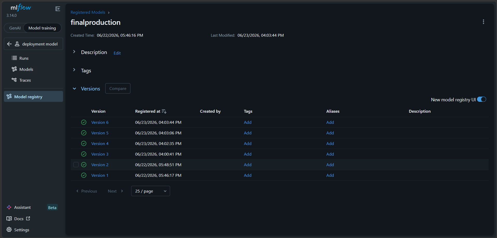

# 🚀 MLflow Model Registration & Deployment Pipeline
## 📖 Overview

This project demonstrates an **End-to-End MLOps Workflow** using **MLflow** for experiment tracking, model versioning, model registration, and deployment.

The notebook trains multiple machine learning models on an imbalanced dataset, compares their performance, logs experiments into MLflow, registers the best model, and promotes it for production deployment.

---

## 🎯 Objectives

- Create an imbalanced classification dataset
- Handle class imbalance using SMOTETomek
- Train multiple machine learning models
- Track experiments using MLflow
- Compare model performance
- Register the best model
- Manage model versions
- Deploy production-ready models

---

## 🏗️ Project Workflow

```text
Dataset Creation
        │
        ▼
Train-Test Split
        │
        ▼
SMOTETomek Resampling
        │
        ▼
Model Training
 ├── Logistic Regression
 ├── Random Forest
 ├── XGBoost
 └── XGBoost + SMOTETomek
        │
        ▼
Model Evaluation
        │
        ▼
MLflow Experiment Tracking
        │
        ▼
Model Logging
        │
        ▼
Model Registry
        │
        ▼
Version Management
        │
        ▼
Production Deployment
```

---

## 🧠 Machine Learning Models Used

### 🔹 Logistic Regression

- Simple and interpretable baseline model
- Suitable for binary classification problems

### 🔹 Random Forest Classifier

- Ensemble learning method
- Reduces overfitting
- Improves prediction accuracy

### 🔹 XGBoost Classifier

- Gradient boosting algorithm
- High-performance classifier
- Excellent for structured datasets

### 🔹 XGBoost + SMOTETomek

- Trained on balanced data
- Better minority-class prediction
- Improved recall and F1-score

---

## ⚖️ Handling Class Imbalance

The dataset contains:

| Class | Percentage |
|---------|-----------|
| Class 0 | 90% |
| Class 1 | 10% |

To solve the imbalance issue:

### 🔸 SMOTE

Creates synthetic samples for minority class.

### 🔸 Tomek Links

Removes overlapping noisy observations.

### 🔸 SMOTETomek

Combines both techniques for better class balancing.

---

## 📊 Evaluation Metrics

The following metrics are tracked for each model:

- ✅ Accuracy
- ✅ Precision
- ✅ Recall
- ✅ F1 Score
- ✅ Macro F1 Score
- ✅ Recall for Class 0
- ✅ Recall for Class 1

---

## 📈 MLflow Features Used

### 📝 Experiment Tracking

Track multiple model runs.

### 📋 Parameter Logging

Store hyperparameters such as:

```python
n_estimators
max_depth
solver
learning_rate
```

### 📊 Metric Logging

Store evaluation metrics.

### 💾 Model Logging

Save trained models as artifacts.

### 🏷️ Model Registry

Register best-performing models.

### 🔄 Version Management

Maintain multiple versions of registered models.

### 🚀 Deployment

Promote models for production use.

---

## 🛠️ Technologies Used

| Technology | Purpose |
|------------|----------|
| Python | Programming Language |
| NumPy | Numerical Computing |
| Scikit-Learn | Machine Learning |
| XGBoost | Gradient Boosting |
| Imbalanced-Learn | Data Balancing |
| MLflow | MLOps Platform |
| Jupyter Notebook | Development Environment |

---

## 📂 Project Structure

```text
MLflow-Model-Registration/
│
├── 3rd_mlflow_model_registiration.ipynb
├── README.md
├── requirements.txt
│
└── images/
    ├── models.png
    ├── parallel_coordinates_plot.png
    ├── model_registry.png
    └── final-production-model.png
```

---

## ⚙️ Installation

### Clone Repository

```bash
git clone https://github.com/manasranjanmeher99/MLflow-Model-Registration.git
```

### Navigate to Project Folder

```bash
cd MLflow-Model-Registration
```

### Install Dependencies

```bash
pip install -r requirements.txt
```

---

## ▶️ Running MLflow Server

```bash
mlflow server ^
--backend-store-uri sqlite:///mlflow.db ^
--default-artifact-root ./artifacts ^
--host 0.0.0.0 ^
--port 5000
```

Open browser:

```text
http://localhost:5000
```

---

## 🚀 Run the Notebook

```bash
jupyter notebook
```

Open:

```text
3rd_mlflow_model_registiration.ipynb
```

Run all cells sequentially.

---

## 📸 Project Screenshots

### 📊 MLflow Models

```md

```

### 📈 Model Comparison Parallel Plot

```md

```

### 🏷️ Model Registry

```text

```

### 🚀 Final Production 

```md

```

---

## 🎓 Key Learning Outcomes

- MLOps Fundamentals
- MLflow Tracking
- Experiment Management
- Model Versioning
- Model Registry
- Model Deployment
- Class Imbalance Handling
- XGBoost Classification
- Production ML Workflow

---

## 📌 Future Improvements

- Docker Deployment
- CI/CD Integration
- FastAPI Model Serving
- Kubernetes Deployment
- Automated Retraining Pipeline
- Cloud Deployment (AWS/Azure/GCP)

---

## 👨‍💻 Author

### Manas Ranjan Meher

🔗 GitHub

[GitHub Profile](https://github.com/manasranjanmeher99)

🔗 LinkedIn

[LinkedIn Profile](https://www.linkedin.com/in/manas-ranjan-meher-606181280/)

---

## ⭐ Support

If you found this project useful:

⭐ Star the repository

🍴 Fork the project

📢 Share it with others

---

### 🚀 End-to-End MLflow Model Registration & Deployment Workflow for MLOps
