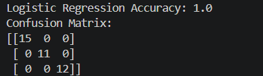
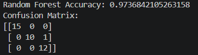

# 🌸 Iris Classification with MLflow Model Registry

## 📌 Project Overview

This project demonstrates an end-to-end Machine Learning workflow using the Iris Dataset and MLflow. It trains and compares two classification models:

* Logistic Regression
* Random Forest Classifier

The project leverages MLflow for:

* 📊 Experiment Tracking
* 📈 Metric Logging
* 📁 Artifact Logging
* 🤖 Model Logging
* 🏷️ Model Registration
* 🔄 Model Versioning

Confusion matrices are generated and logged as artifacts for performance analysis.

---

## 🚀 Features

✅ Load and preprocess the Iris dataset

✅ Train multiple machine learning models

✅ Track experiments using MLflow

✅ Log parameters, metrics, and artifacts

✅ Generate confusion matrix visualizations

✅ Register trained models in MLflow Model Registry

✅ Load registered models for future inference

---

## 🛠️ Technologies Used

| Technology   | Purpose                              |
| ------------ | ------------------------------------ |
| Python       | Programming Language                 |
| Pandas       | Data Manipulation                    |
| Scikit-Learn | Machine Learning Models              |
| MLflow       | Experiment Tracking & Model Registry |
| Matplotlib   | Visualization                        |
| Seaborn      | Confusion Matrix Visualization       |

---

## 📂 Project Structure

```text
iris-mlflow-model/
│
├── artifacts/
│   ├── lr_conf_matrix.png
│   └── rf_conf_matrix.png
│
├── screenshots/
│   ├── logistic_regression_results.png
│   └── random_forest_results.png
│
├── mllop code-1.py
├── requirements.txt
└── README.md
```

---

## 📊 Dataset Information

The project uses the Iris Dataset available in Scikit-Learn.

### Features

* Sepal Length
* Sepal Width
* Petal Length
* Petal Width

### Target Classes

* Setosa
* Versicolor
* Virginica

Dataset Size:

* 150 Samples
* 4 Features
* 3 Classes

---


## ▶️ Running the Project

Execute the script:

```bash
python iris_mlflow.py
```

---

## 📈 MLflow UI

Launch MLflow Tracking UI:

```bash
mlflow ui
```

Open your browser and visit:

```text
http://127.0.0.1:5000
```

You can view:

* Experiments
* Parameters
* Metrics
* Artifacts
* Registered Models

---

## 🧠 Models Used

### Logistic Regression

Parameters:

```python
LogisticRegression(
    max_iter=50,
    C=1000,
    solver='liblinear'
)
```

Logged Information:

* Accuracy Score
* Confusion Matrix
* Model Artifact
* Registered Model

---

### Random Forest Classifier

Parameters:

```python
RandomForestClassifier(
    n_estimators=10,
    max_depth=3,
    min_samples_split=10,
    criterion='entropy'
)
```

Logged Information:

* Accuracy Score
* Confusion Matrix
* Model Artifact
* Registered Model

---

## 📉 Confusion Matrix

The project automatically generates confusion matrices for both models and stores them as MLflow artifacts.

Example:

```text
True Labels vs Predicted Labels
```

These visualizations help evaluate classification performance across all Iris species.

---

## 🏷️ Model Registry

The trained models are automatically registered in the MLflow Model Registry.

Registered Models:

* Logistic_Regression_Model
* Random_Forest_Model

Benefits:

* Model Versioning
* Stage Management
* Easy Deployment
* Centralized Model Storage

---

## 📸 Screenshots

### Logistic Regression Results

```markdown

```

### Random Forest Results

```markdown

```

---

## 📋 Example Output

```text
Logistic Regression Accuracy: 1.0

Confusion Matrix:
[[15 0 0]
 [ 0 11 0]
 [ 0 0 12]]

Random Forest Accuracy: 0.97

Confusion Matrix:
[[15 0 0]
 [ 0 10 1]
 [ 0 0 12]]
```

---

## 🎯 Learning Outcomes

By completing this project, you will learn:

* Experiment Tracking with MLflow
* Model Registry and Versioning
* Classification using Scikit-Learn
* Logging Metrics and Artifacts
* Managing Machine Learning Experiments
* Building Reproducible ML Pipelines

---

## 👨‍💻 Author

**Manas Ranjan Meher**

* GitHub: https://github.com/manasranjanmeher99
* LinkedIn: https://www.linkedin.com/in/manas-ranjan-meher-606924237/

---

## ⭐ If you found this project useful

Give this repository a ⭐ on GitHub and share it with others interested in MLOps and Machine Learning.
